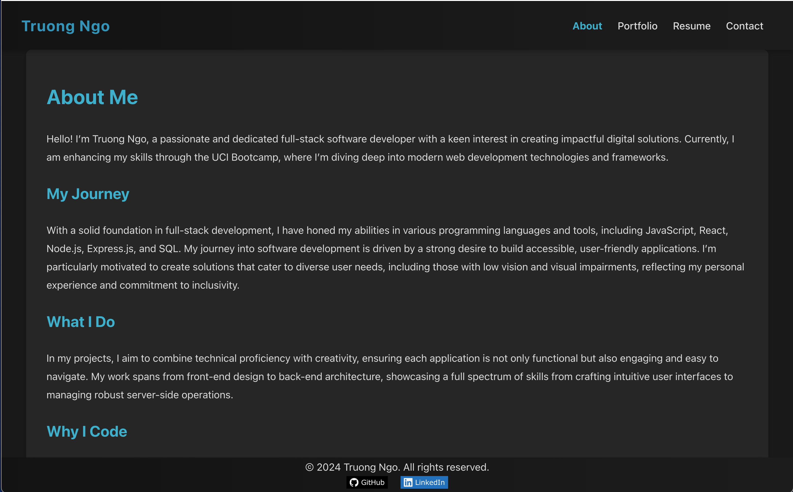

# Reactfolio

This is a personal portfolio website built using React, showcasing various projects and skills.

## Table of Contents

- [Installation](#installation)
- [Usage](#usage)
- [Features](#features)
- [Screenshots](#screenshots)
- [Deployment](#deployment)
- [License](#license)
- [Contact](#contact)

## Installation

To run this project locally, follow these steps:

1. **Clone the repository**:

   ```bash
   git clone https://github.com/ngojohn2002/dev-react-portfolio.git
   cd dev-react-portfolio
   ```

2. **Install dependencies**:

   ```bash
   npm install
   ```

3. **Start the development server**:

   ```bash
   npm run dev
   ```

   This command will start the Vite development server. Open your browser and go to `http://localhost:3000/` to see the website.

## Usage

The portfolio showcases projects, skills, and contact information. You can navigate through the website using the navigation menu in the header.

## Features

- **React**: Built using React for a dynamic and responsive user interface.
- **Responsive Design**: Optimized for desktop and mobile devices.
- **Easy Navigation**: Clear and intuitive navigation with sticky header and footer.
- **Project Showcase**: Displays various projects with links to GitHub repositories and live demos.
- **Contact Form**: Allows users to get in touch.

## Screenshots



## Deployment

This application is deployed on Netlify. You can visit the live site here: [Dev React Portfolio](https://enchanting-ganache-d92d7f.netlify.app/)

## License

This project is licensed under the MIT License. See the [LICENSE](./LICENSE) file for more details.

## Contact

For any questions or feedback, please contact me at [ngojohn2002@yahoo.com](mailto:ngojohn2002@yahoo.com).

&copy; 2024 - Truong Ngo. All rights reserved.

(20-React)